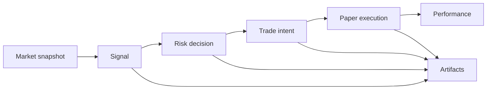

# VeriTrade — Architecture (thin slice)

## Purpose

VeriTrade demonstrates a **governed** autonomous trading loop: market context produces a **signal**, **risk policy** approves or blocks it, a **canonical trade intent** is recorded **before** any execution, **paper execution** produces fills or rejects, **artifacts** provide an audit trail, and **performance** state updates for the operator.

This overnight build optimizes for **judge comprehension** and a **working end-to-end path**, not strategy alpha.

**Trust narrative (judges):** [trust-and-risk.md](trust-and-risk.md) — how provenance, policy, intent-first execution, artifacts, and paper default combine into a credible story.

**Challenge / rubric:** [challenge-alignment.md](challenge-alignment.md) — Kraken surface, ERC-8004-flavored identity, `GET /challenge/context`.

## Components

| Layer | Responsibility |
|--------|----------------|
| **Market** | Mock snapshot ingest (`market_snapshots`) — price, optional volatility flag, timestamp. |
| **Strategy** | Baseline MA-style rule → `signals` (type, confidence, rationale). |
| **Risk** | Policy evaluation → `risk_decisions` with verdict: `allow`, `allow_with_reduction`, `block`, `escalate_for_review`. |
| **Intent** | Canonical `trade_intents` row before execution; API adds **`intent_commitment_sha256`** (off-chain binding hash). |
| **Execution** | **Paper adapter** → `executions` (filled/rejected). Parallel **Kraken execution surface** → typed **CLI order draft** (no network I/O in paper mode). |
| **Artifacts** | Typed records + JSON files under `ARTIFACTS_DIR` for `signal`, `risk`, `intent`, `execution`. |
| **Performance** | Rolling `performance_snapshots` (equity, PnL, drawdown, position notional). |
| **Control** | `system_control` row: `running` / `paused` / `stopped`, `manual_pause`, `no_trade`. |

## Request flow (one cycle)

1. **Ingest** mock snapshot (or reuse latest in edge cases).
2. **Persist signal** and `signal` artifact.
3. **Risk** reads latest performance, snapshot freshness, flags, control state; may **reduce** requested notional.
4. On **block** or **escalate**: write alerts/intents as appropriate; **no** execution for block.
5. On **allow** / **allow_with_reduction**: create **intent**, `intent` artifact, **simulate** order, `execution` artifact, update **performance** if filled.

## API surface

- **Health:** `GET /health`, `GET /ready`
- **Challenge:** `GET /challenge/context` — agent id, trust signals, Kraken surface + optional order draft
- **Operator:** `GET /overview` (includes `challenge`), `GET /performance`, `GET /activity`
- **Domain:** `GET /signals`, `/risk-decisions`, `/intents`, `/executions`, `/artifacts`, `/alerts`
- **Control:** `POST /control/start`, `/pause`, `/stop`, `/step`, `/manual-pause`
- **Demo:** `POST /demo/seed`, `POST /demo/run-once` (respects pause; use `/control/step` when paused)

## Frontend

Vite + React **operator console**: **Agent identity / trust / validation** (from `challenge`), **badges**, **decision pipeline** (challenge-native labels), formatted **performance**, **validation artifact trace**, detail cards (**Risk router**, **Signed trade intent** with commitment hash, **Venue execution**), grouped **operator controls**.

## Kraken adapter surface (code)

- [`apps/api/app/adapters/kraken_execution_surface.py`](../apps/api/app/adapters/kraken_execution_surface.py) — status + `build_kraken_cli_order_draft()`
- [`apps/api/app/challenge/context.py`](../apps/api/app/challenge/context.py) — bundles challenge context for `GET /overview`
- [`apps/api/app/challenge/intent_commitment.py`](../apps/api/app/challenge/intent_commitment.py) — SHA-256 commitment helper

## Persistence

- **SQLite** file path from `DATABASE_URL` in `.env` (default `./veritrade.db` relative to process cwd — run API from repo root).
- **Filesystem artifacts** under `./artifacts` (gitignored).

## Non-goals (this slice)

- Live exchange connectivity, auth, multi-user, mobile, advanced charts, full backtest engine.

See [known-gaps.md](known-gaps.md) for deliberate stubs.
